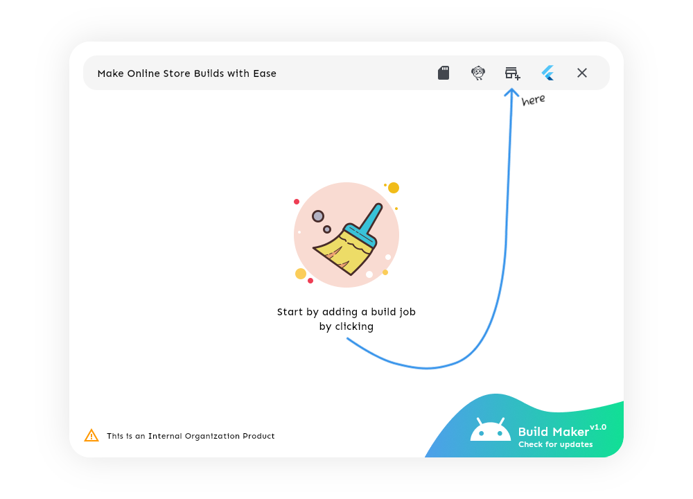

    
    
Android Build Automation Tool

    
made by @omegaui

- Automate App Icon Generation
- Auto Source Edit for Master Phone Number
- Automate Build and Clean Up
- Configure Flutter and Repository Location
- Build Multiple Apps in Queue
- Portable Configuration

### License
Permissions and Regulations are implied as:
- No one can replicate the source code
- No one can redistribute the source code
- No one can publish it under any name on any app store
- The Source code can only be used for educational purpose.